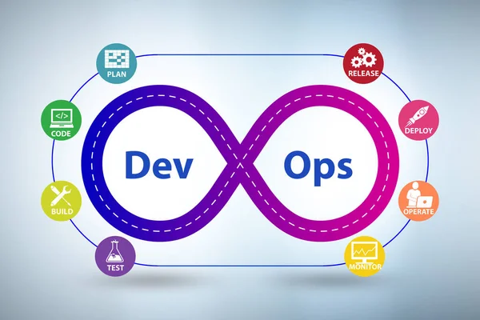

# Bash Scripting Course

Welcome to the Bash Scripting Course! This course is designed to help you learn and master the fundamentals of Bash scripting, a powerful and widely-used shell scripting language in Unix-like operating systems.

## Table of Contents
1. Introduction
2. Prerequisites
3. Course Overview
4. Getting Started
5. Modules
6. Exercises
7. Contributing
8. License

## Introduction
Bash (Bourne Again SHell) is a command processor that typically runs in a text window where the user types commands that cause actions. Bash can also read and execute commands from files, known as shell scripts. This course is aimed at beginners and intermediate users who want to enhance their command-line skills and automate tasks using Bash scripting.

## Prerequisites
Before you start this course, make sure you have the following prerequisites:
- Basic understanding of the command line interface.
- Access to a Unix-like operating system (Linux or macOS recommended).
- A text editor of your choice (e.g., Vim, Nano, VSCode).

## Course Overview
The course is divided into several modules, each covering specific aspects of Bash scripting and its application in DevOps and web infrastructure. Whether you're a beginner or looking to deepen your understanding, the course provides a structured path to follow. Each module includes hands-on exercises to reinforce your learning.

## Getting Started
To get started with the course, clone this repository to your local machine:
```bash
git clone https://github.com/hima890/alx-system_engineering-devops.git
cd bash-scripting-course
```
Refer to the specific module's README file for detailed instructions on each topic.

## Modules
1. **Module 1: Introduction to Bash**
   - Basic commands
   - Shell scripting fundamentals

2. **Module 2: Variables and Data Types**
   - Declaring and using variables
   - String manipulation
   - Numeric operations

3. **Module 3: Control Structures**
   - Conditional statements
   - Loops

4. **Module 4: Functions**
   - Writing and using functions
   - Function parameters and return values

5. **Module 5: File Handling**
   - Reading and writing to files
   - File permissions

6. **Module 6: Advanced Topics**
   - Regular expressions
   - Process management
   - Command substitution
   - DevOps integration and server configuration

## Exercises
Each module includes practical exercises to reinforce your learning. Complete the exercises to gain hands-on experience with Bash scripting. Solutions are provided in the respective module directories.

## Contributing
We welcome contributions to improve the course content, fix bugs, or add new exercises. Please follow the contribution guidelines before submitting a pull request.

## License
This course is licensed under the MIT License - see the LICENSE file for details.

## About
Master Bash scripting and elevate your DevOps prowess with this comprehensive course. Learn from foundational commands to advanced techniques, empowering you to automate tasks, streamline server configurations, and optimize web infrastructure. Dive into hands-on exercises, real-world applications, and contribute to building robust systems.

### Topics
devops networking bash-script serverconfig alx-africa alx-software-engineering alx-backend webinfrastructure
